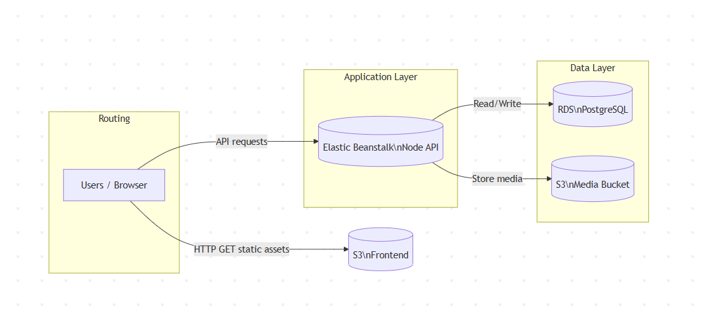

# Infrastructure Description

## Overview
This document describes the AWS infrastructure used to deploy the Udagram application.

The application follows a cloud-native, scalable architecture using managed AWS services.

---

## AWS Services Used

### 1. AWS S3 (Frontend Hosting)
- Hosts the Angular frontend application
- Configured for static website hosting
- Public access enabled for read-only content
- Serves the application via HTTP

---

### 2. AWS Elastic Beanstalk (Backend API)
- Hosts the Node.js (TypeScript) REST API
- Automatically manages EC2 instances, load balancing, and scaling
- Environment variables configured for database and AWS access
- Health monitoring enabled

---

### 3. AWS RDS (PostgreSQL Database)
- Stores application data (users, images)
- Runs PostgreSQL engine
- Secured using Security Groups
- Public access enabled only for Elastic Beanstalk

---

### 4. CircleCI (CI/CD Pipeline)
- Automates build and deployment
- Triggered on every push to `main`
- Secrets stored securely using CircleCI Environment Variables
- Deploys backend to Elastic Beanstalk
- Uploads frontend build to S3

---

## Security
- No credentials are hard-coded in the source code
- AWS credentials are stored securely in CircleCI
- Database access restricted via Security Groups

---

## Architecture Diagram
See  for a high-level overview of the system.
