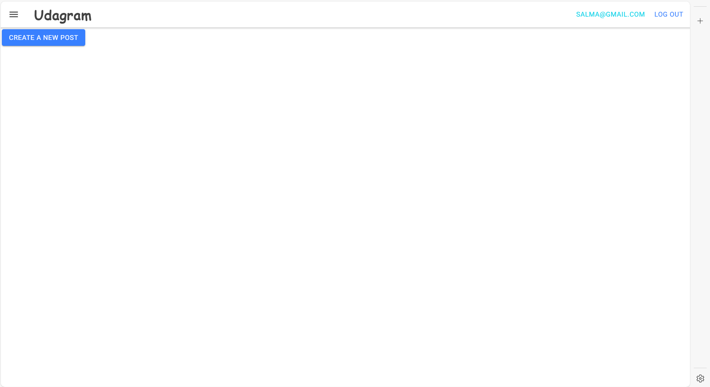
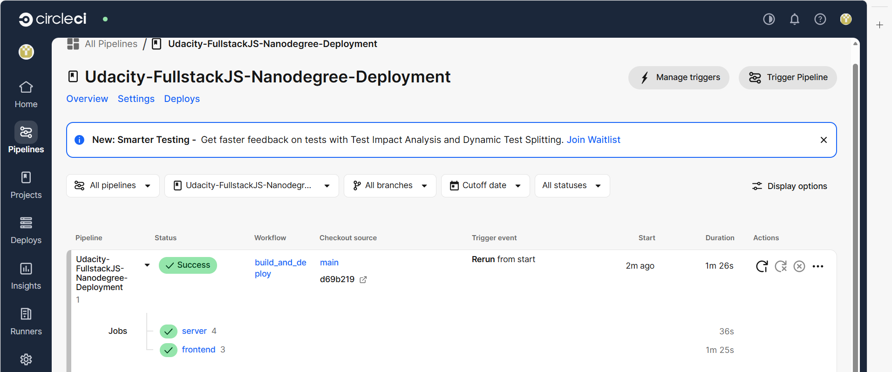
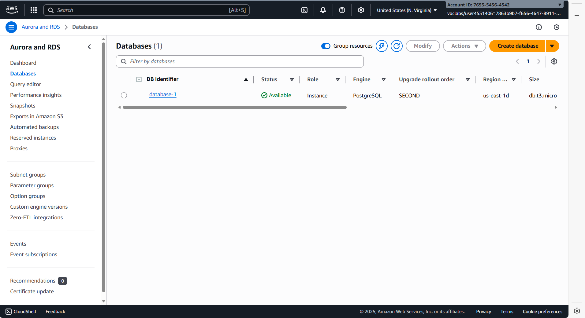
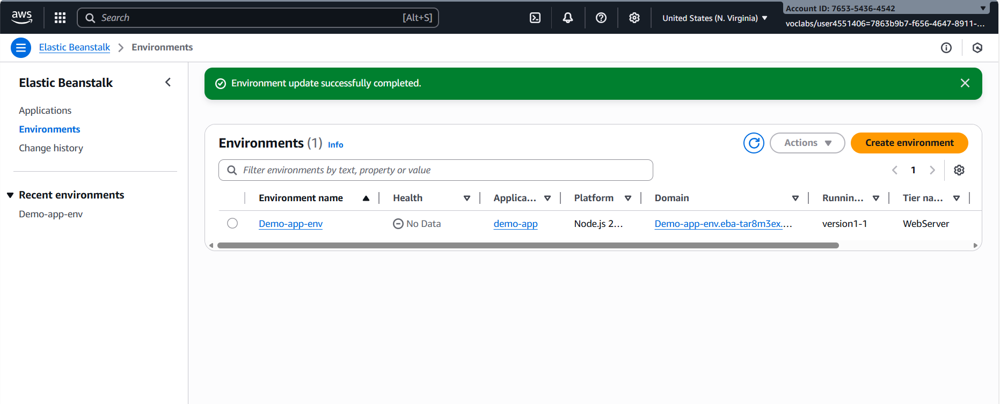
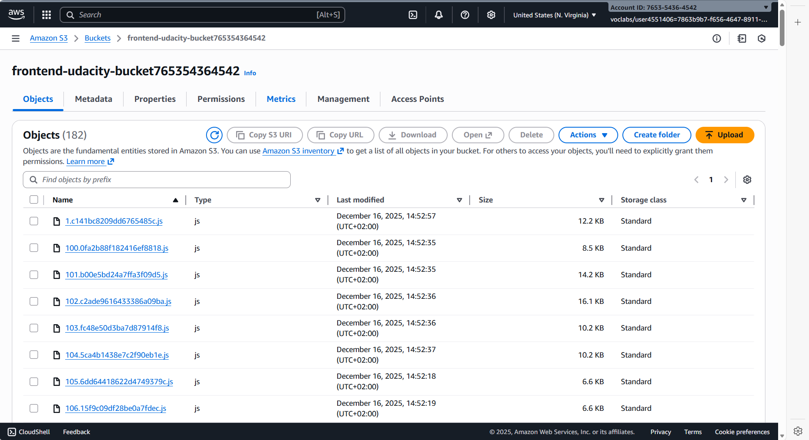

# Udagram – Image Filtering Application (AWS Deployment)

## Project Overview
Udagram is a full-stack image filtering application deployed on AWS.  
Users can register, log in, upload images, and process them using a backend image filtering service.

This project demonstrates deploying a full-stack application using:
- AWS Elastic Beanstalk (Backend API)
- AWS S3 (Frontend Hosting)
- AWS RDS (PostgreSQL Database)
- CircleCI (CI/CD Pipeline)

---

## Application Architecture
- **Frontend**: Angular application hosted on AWS S3
- **Backend**: Node.js (TypeScript) REST API deployed on AWS Elastic Beanstalk
- **Database**: PostgreSQL database hosted on AWS RDS
- **CI/CD**: CircleCI pipeline triggered on every push to the `main` branch

---

## Live Application Links

- **Frontend Application (S3)**  
  👉 http://frontend-udacity-bucket765354364542.s3-website-us-east-1.amazonaws.com

- **Backend API (Elastic Beanstalk)**  
  👉 http://Demo-app-env.eba-tar8m3ex.us-east-1.elasticbeanstalk.com/api/v0

---

## Screenshots

### Working Application

### CircleCI Successful Pipeline

### AWS RDS Database

### AWS Elastic Beanstalk Backend

### AWS S3 Frontend Hosting

---

## CI/CD Pipeline
- Code is pushed to GitHub
- CircleCI pipeline runs automatically
- Build, test, and deployment steps are executed
- Secrets are managed using CircleCI Environment Variables

---

## Environment Variables
All sensitive values (AWS keys, DB credentials, JWT secret) are:
- **NOT** stored in source code
- Configured securely in CircleCI and Elastic Beanstalk

---

## Author
Salma Tarek
